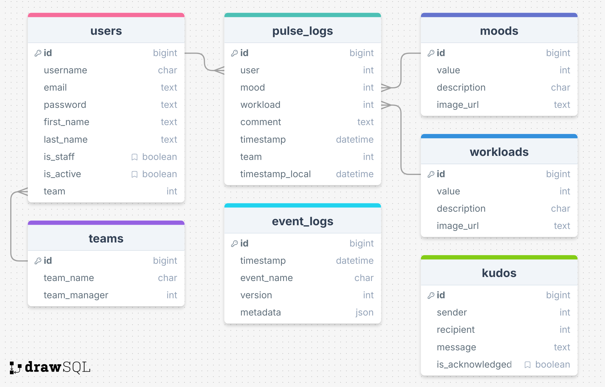

# Team Pulse Backend
> Team: Full-stack Frogs

## Table of Contents

- [Team Pulse Backend](#team-pulse-backend)
  - [Table of Contents](#table-of-contents)
  - [Mission Statement](#mission-statement)
  - [Features](#features)
    - [Summary](#summary-)
    - [Users](#users)
    - [Pulse Logs](#pulse-logs-)
    - [Nice To Haves](#nice-to-haves)
  - [Technical Implementation](#technical-implementation)
    - [Back-End](#back-end)
    - [Front-End](#front-end)
    - [Git \& Deployment](#git--deployment)
  - [Target Audience](#target-audience)
  - [Back-end Implementation](#back-end-implementation)
    - [API Specification](#api-specification)
    - [Object Definitions](#object-definitions)
      - [Users](#users-1)
      - [Teams](#teams)
      - [Moods](#moods)
      - [Workloads](#workloads)
      - [Pulse Logs](#pulse-logs)
    - [Database Schema](#database-schema)

## Mission Statement

The purpose of this project is to create a simple, user-friendly mobile and desktop application that helps managers monitor and improve team wellbeing, mood, and workload. The dashboard will allow team members to share how they are feeling on a weekly basis and report their current workload, providing a clear, real-time view of the team’s overall health.

## Features

### Summary 
Provide Guest users ability to post sticky notes to a live event board. Once posted, users can view all posts for live event. Admin and approver access will allow events boards to be created, sticky notes to be edited, approved and exported.

### Users

| Type      | Access                                                                                                                                                                                                                                                | Role type assignment  |
|:----------|:------------------------------------------------------------------------------------------------------------------------------------------------------------------------------------------------------------------------------------------------------|:----------------------|
| Superuser |   - All access     - Can log in    - Can log out    - Create and manage Teams    - Create and manage Moods    - Create and manage Workloads    - View users list   - Update user details    - Submit and manage Pulse Logs | Full-stack frogs team |
| Manager   |   - Can log in    - Can log out    - Create and manage Teams    - Create and manage Moods    - Create and manage Workloads    - View users list    - View user details   - Submit Pulse Logs                                  | Managers              |
| User      |   - Can log in    - Can log out    - Submit Pulse Log    - View and update own details    - Send kudos to another user                                                                                                                 | Logged in User        |

### Pulse Logs 
User can submit a Pulse Log containing a chosen mood, chosen workload and optional comment. Restrictions apply:

- User can only submit once a week.
- User can not update submitted data

### Nice To Haves

- Reminder email at a set time in the week to prompt user to submit their Pulse Log for the current week
- A trend of the user's own mood and workload score over time
- Send kudos from one user to another

## Technical Implementation

### Back-End

- Django / DRF API
- Python

### Front-End

- React / JavaScript
- HTML/CSS

### Git & Deployment
- Heroku
- Netlify
- GitHub

This application's back-end will be deployed to Heroku. The front-end will be deployed separately to Netlify.
 
We will also use Insomnia to ensure API endpoints are working smoothly (we will utilise a local and deployed environment in Insomnia).

## Target Audience

Team Pulse is for remote or hybrid teams and their managers. Team members use it to share weekly mood and workload check-ins, while managers get a clear overview of team wellbeing.

## Back-end Implementation
### API Specification

| HTTP Method | URL                                      | Purpose                                                                            | Request Body                                                                                                | Successful Response Code | Authentication and Authorization |
|:------------|:-----------------------------------------|:-----------------------------------------------------------------------------------|:------------------------------------------------------------------------------------------------------------|:-------------------------|:---------------------------------|
| POST        | /api-token-auth                          | Allow users to log in                                                              | ““Username”:”string”, “password”:”string”                                                                   | 200                      | N/A                              |
| POST        | /me                                      | Return details of the currently logged on user                                     |                                                                                                             | 200                      | Token auth                       |
| GET         | /moods                                   | Returns a list of Moods                                                            |                                                                                                             | 200                      | Open access                      |
| POST        | /moods                                   | Create new Mood                                                                    | "value": integer, "description": "string", "image_url": "string"                                            | 201                      | Superuser or Staff               |
| PUT         | /moods/id                                | Update existing Mood                                                               | "value": integer, "description": "string", "image_url": "string"                                            | 200                      | Superuser or Staff               |
| GET         | /workloads                               | Returns a list of Workloads                                                        |                                                                                                             | 200                      | Open access                      |
| POST        | /workloads                               | Create new Workload                                                                | "value": integer, "description": "string", "image_url": "string"                                            | 201                      | Superuser or Staff               |
| PUT         | /workloads/id                            | Update existing Workload                                                           | "value": integer, "description": "string", "image_url": "string"                                            | 200                      | Superuser or Staff               |
| GET         | /teams                                   | Return a list of Teams                                                             |                                                                                                             | 200                      | Open access                      |
| GET         | /teams                                   | Return a list of Teams with more details                                           |                                                                                                             | 200                      | Superuser or Staff               |
| POST        | /teams/                                  | Create new Team                                                                    | "team_name": "string"                                                                                       | 201                      | Superuser or Staff               |
| PUT         | /teams/id                                | Update existing Team                                                               | "team_name": "string", "team_manager": integer                                                              | 200                      | Superuser or Staff               |
| GET         | /users                                   | Return a list of users                                                             |                                                                                                             | 200                      | Superuser or Staff               |
| POST        | /users                                   | Create a new User                                                                  | "username": "string", "password": "string", "first_name": "string", "last_name": "string", "team": integer  | 201                      | Open access                      |
| PUT         | /users/id                                | Update existing User                                                               | "username": "string", "password": "string", "first_name": "string", "last_name": "string", "team": integer  | 200                      | Superuser or Owner of data       |
| GET         | /users/id                                | Return User details and their last 26 logged Pulse Log                             |                                                                                                             | 200                      | Superuser, Staff, Owner of data  |
| GET         | /users/id/?limit=3                       | Return User details and their last 3 logged Pulse Log                              |                                                                                                             | 200                      | Superuser, Staff, Owner of data  |
| GET         | /users/?year_week=index                  | Return a list of users who have Pulse Log data for the specified year_week         |                                                                                                             | 200                      | Superuser or Staff               |
| GET         | /users/?year_week=index&missing_log=true | Return a list of users who do NOT have Pulse Log data for the specified year_week  |                                                                                                             | 200                      | Superuser or Staff               |
| GET         | /pulse_logs                              | Return a list of Pulse Logs                                                        |                                                                                                             | 200                      | Superuser or Staff               |
| POST        | /pulse_logs                              | Create a new Pulse Log                                                             | "team": integer, "timestamp_local": "datetime", "mood": integer, "workload": integer                        | 201                      | Token auth                       |
| PUT         | /pulse_logs/id                           | Update existing Pulse Log                                                          | "timestamp_local": "datetime", "mood": integer, "workload": integer                                         | 200                      | Superuser                        |
| GET         | /pulse_logs/?year_week=index             | Return a list of Pulse Logs for the selected year_week index                       |                                                                                                             | 200                      | Superuser or Staff               |
| GET         | /event_logs                              | Return a list of event_logs                                                        |                                                                                                             | 200                      | Superuser                        |

### Object Definitions

#### Users
| Field              | Data type                    |
|:-------------------|:-----------------------------|
| *id (PK)*          |                              |
| *username*         | string                       |
| email              | string                       |
| first_name         | string                       |
| last_name          | string                       |
| team (FK)          | integer                      |
| is_staff           | boolean                      |
| is_active          | boolean                      |
| logged_pulses      | collection of pulse_log data |

#### Teams
| Field                   | Data Type | Note                            |
|:------------------------|:----------|:--------------------------------|
| id (PK)                 | integer   |                                 |
| team_name               | string    |                                 |
| team_manager            | integer   | Only viewable by logged in user |
| user_count              | integer   | Only viewable by logged in user |

#### Moods
| Field       | Data type |
|:------------|:----------|
| *id (PK)*   |           |
| value       | integer   |
| description | string    |
| image_url   | string    |

#### Workloads
| Field       | Data type |
|:------------|:---------|
| *id (PK)*   |          |
| value       | integer  |
| description | string   |
| image_url   | string   | 

#### Pulse Logs
| Field           | Data type |
|:----------------|:----------|
| *id (PK)*       |           |
| user (FK)       | integer   |
| first_name      | string    |
| last_name       | string    |
| team            | integer   |
| year            | integer   | 
| week_index      | integer   |
| year_week       | integer   |
| timestamp       | datetime  |
| timestamp_local | datetime  |
| mood (FK)       | integer   |
| workload (FK)   | integer   |
| comment         | string    |

### Database Schema

